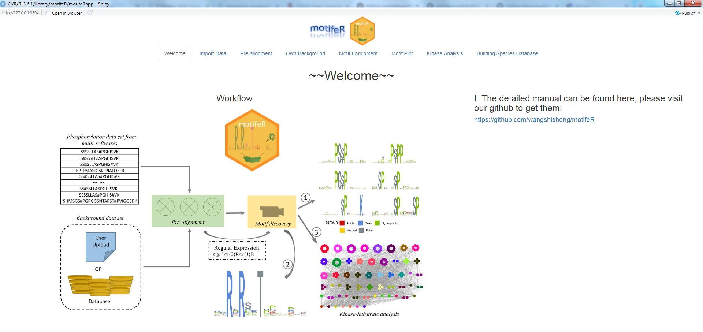

# motifeRapp
This is a R package for motifeR software.  
The detailed information can be found at [https://github.com/wangshisheng/motifeR](https://github.com/wangshisheng/motifeR).  
The online version is available here: [https://www.omicsolution.org/wukong/motifeR](https://www.omicsolution.org/wukong/motifeR).

## Preparation
This tool is developed with R, so if you want to run it locally, you may do some preparatory work:  
**1. Install R.** You can download R from here: [https://www.r-project.org/](https://www.r-project.org/).  
**2. Install RStudio.** (Recommendatory but not necessary). You can download RStudio from here: [https://www.rstudio.com/](https://www.rstudio.com/).  
**3. Check packages.** After installing R and RStudio, you should check whether you have installed these packages (shiny, shinyBS, shinyjs, DT, gdata, knitr, ggplot2, ggsci, openxlsx, data.table, Biostrings, stringi, stringr, ggrepel, igraph, ggraph, graphlayouts, scales). You may run the codes below to check them:  

```r
if(!require(pacman)) install.packages("pacman")
pacman::p_load(devtools,shiny,shinyBS,shinyjs,DT,gdata,knitr,ggplot2,ggsci,openxlsx,data.table,Biostrings,stringi,stringr,ggrepel,igraph,ggraph,graphlayouts,scales)
```

**4. Install packages locally.** motifeR needs two more packages ([rmotifx](https://github.com/omarwagih/rmotifx) and [ggseqlogo](https://github.com/omarwagih/ggseqlogo)), however, the functions in the two packages are not enough. I update some functions, and you should download and then install them locally.

rmotifx: download from here: [https://github.com/wangshisheng/motifeR/blob/master/rmotifx_1.0.tar.gz](https://github.com/wangshisheng/motifeR/blob/master/rmotifx_1.0.tar.gz).  
ggseqlogo: download from here: [https://github.com/wangshisheng/motifeR/blob/master/ggseqlogo_0.1.tar.gz](https://github.com/wangshisheng/motifeR/blob/master/ggseqlogo_0.1.tar.gz).

After downloading them, set the path where the packages are:
```r
setwd('path') #path is where the two packages are.
install.packages("rmotifx_1.0.tar.gz", repos = NULL,type="source")
install.packages("ggseqlogo_0.1.tar.gz", repos = NULL,type="source")
```

## Run it locally
If the preparatory work has been done, you can run this tool locally as below:
```r
if(!require(motifeR)) devtools::install_github("wangshisheng/motifeRapp")
library(motifeR)
motifeR_app()
```
Then motifeR will be started as below:



**Bravo!** You are successful to run motifeR locally, then you can analyze your own data. Enjoy yourself^_^


## Friendly suggestion
1. Open motifeR with Chrome or Firefox.
2. The minimum operating system specifications are: **RAM 4GB, Hard drive 100 GB.**
